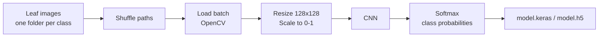
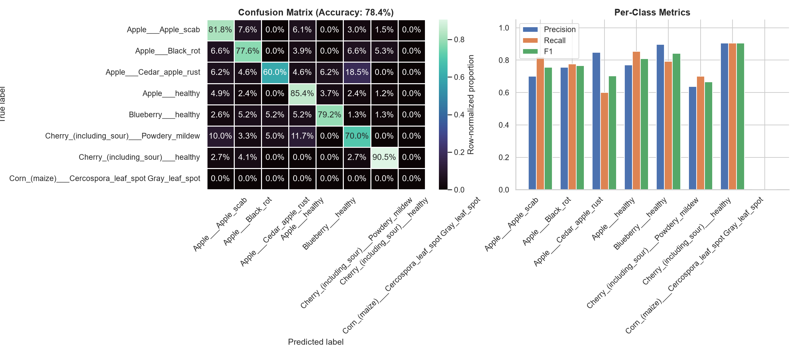

<div align="center">

# 🌿 Plant Disease Classification

**A CNN that looks at a leaf photo and tells you whether the plant is healthy or which disease it has.**


</div>

---

## 📖 Overview

Plant diseases reduce crop yield, and catching them early matters. This project trains a **Convolutional Neural Network (CNN)** on labelled leaf images from the Kaggle **New Plant Diseases Dataset (Augmented)**. Every sub-folder of the training directory is one class, and the model predicts which class a new leaf image belongs to.

**Highlights**

- 🧠 Custom 3-block CNN built with TensorFlow / Keras
- 🌊 Memory-friendly `tf.data` generator pipeline that streams images in batches instead of loading the whole dataset
- 🔢 Number of classes is detected automatically from the dataset folders
- 💾 Trained models exported in both `.keras` and `.h5` formats
- 📊 Confusion matrix and metrics stored in `evaluation/`

---

## 🔄 Pipeline



---

## 🏗️ Model Architecture

| # | Layer | Details |
|---|-------|---------|
| 1 | Input | 128 × 128 × 3 |
| 2 | Conv2D + MaxPool | 32 filters, 3×3, ReLU, same padding, 2×2 pool |
| 3 | Conv2D + MaxPool | 64 filters, 3×3, ReLU, same padding, 2×2 pool |
| 4 | Conv2D + MaxPool | 128 filters, 3×3, ReLU, same padding, 2×2 pool |
| 5 | Flatten | |
| 6 | Dense | 256 units, ReLU |
| 7 | Dropout | rate 0.5 |
| 8 | Dense (output) | one unit per class, Softmax |

### ⚙️ Training setup

| Setting | Value |
|---------|-------|
| Image size | 128 × 128 |
| Batch size | 32 |
| Epochs | 15 |
| Optimizer | Adam |
| Loss | Sparse categorical cross-entropy |
| Metric | Accuracy |
| Seed | 42 |
| Callbacks defined | EarlyStopping (`val_loss`, patience 5), ModelCheckpoint (`best_plant_disease_model.keras`), ReduceLROnPlateau (factor 0.5, patience 3) |

---

## 📊 Evaluation

The confusion matrix and metrics for the trained model are saved in [`evaluation/evaluation.png`](evaluation/evaluation.png).

<div align="center">



</div>

| Metric | Result |
|--------|--------|
| Accuracy | _add from evaluation.png_ |
| Precision | _add from evaluation.png_ |
| Recall | _add from evaluation.png_ |
| F1-score | _add from evaluation.png_ |

---

## 📁 Project Structure

```text
Plant-Disease-Classification/
├── data/
│   └── data.txt                        # Where to get and place the dataset
├── evaluation/
│   └── evaluation.png                  # Confusion matrix + metrics
├── src/plant_disease_classification/
│   └── __init__.py                     # Package entry point (scaffold)
├── back.ipynb                          # Jupyter notebook
├── main.py                             # Data pipeline, model and training
├── best_plant_disease_model.keras      # Best checkpoint
├── plant_disease_model.keras           # Saved model
├── model.keras                         # Final model (Keras format)
├── model.h5                            # Final model (HDF5 format)
├── pyproject.toml                      # Project metadata and dependencies
├── uv.lock                             # Locked dependencies (uv)
├── requirements.txt                    # pip fallback
└── .python-version
```

---

## 🚀 Getting Started

### 1. Clone

```bash
git clone https://github.com/himanshuchandrakar465/Plant-Disease-Classification.git
cd Plant-Disease-Classification
```

### 2. Install dependencies

```bash
# Option A: uv (recommended, matches pyproject.toml and uv.lock)
uv sync

# Option B: pip
pip install -r requirements.txt
```

### 3. Download the dataset

The dataset is not bundled in the repository. Download it from Kaggle (requires a configured [Kaggle API token](https://www.kaggle.com/docs/api)):

```bash
kaggle datasets download -d vipoooool/new-plant-diseases-dataset -p data --unzip
```

Or download it manually from the Kaggle page and place it under `data/`.

### 4. Train

```bash
python main.py
```

`main.py` reads the training folder from the `folder` variable at the top of the script. It is currently a Windows-style path:

```text
data\archive\New Plant Diseases Dataset(Augmented)\New Plant Diseases Dataset(Augmented)\train
```

Update it to match where you extracted the dataset. Training saves `model.keras` and `model.h5`.

---

## 🔮 Using a Trained Model

```python
import cv2
import numpy as np
import tensorflow as tf

model = tf.keras.models.load_model("model.keras")

img = cv2.imread("leaf.jpg")
img = cv2.resize(img, (128, 128)) / 255.0

probs = model.predict(np.expand_dims(img, axis=0))
class_index = int(np.argmax(probs))
print("Predicted class index:", class_index)
```

Class indices follow the order in which `main.py` lists the class folders in the training directory.

---

## 🧰 Tech Stack

| Area | Tools |
|------|-------|
| Deep learning | TensorFlow, Keras |
| Image processing | OpenCV, Pillow |
| Data and evaluation | NumPy, Pandas, scikit-learn |
| Visualization | Matplotlib, Seaborn |
| Dataset access | Kaggle API |
| App (planned) | Streamlit |
| Tooling | uv, Ruff, Jupyter (ipykernel) |

---

## 🗺️ Roadmap

- [ ] Build the Streamlit app for interactive leaf-image predictions (dependency is installed, UI not built yet)
- [ ] Make dataset paths OS-independent using `pathlib` instead of hard-coded `\\` splits
- [ ] Pass the defined callbacks and a validation set to `fit()` so early stopping and checkpointing take effect
- [ ] Add a license

---

## 👤 Author

**Himanshu Chandrakar** · [@himanshuchandrakar465](https://github.com/himanshuchandrakar465)

---

<div align="center">

⭐ If you find this project useful, consider giving it a star.

</div>
